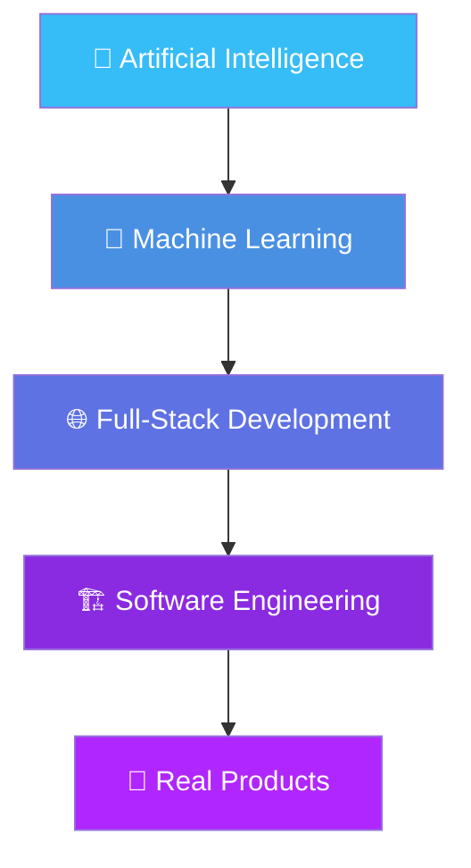

<div align="center">


<br>


<br>

<a href="https://www.linkedin.com/in/raza-ahmed1/">
  
</a>
<a href="https://razaahmed1.github.io/">
  
</a>

<br><br>

</div>


## 👋 About Me

I'm **Ahmed Raza**, a Software Engineering student passionate about building modern software solutions and exploring the world of Artificial Intelligence.

My interests sit at the intersection of **software engineering, AI/ML, and full-stack development** — I enjoy turning ideas into working applications, from designing databases and backend logic to experimenting with machine learning models.

<div align="center">

```text
💡 Idea  →  🧠 Research  →  🏗️ Design  →  💻 Development  →  🧪 Testing  →  🚀 Deployment
```

</div>

<table align="center">
<tr>
<td width="50%" valign="top">

### 🔥 What I'm Into
- 🤖 Artificial Intelligence & Machine Learning
- 🌐 Full-Stack Web Development
- 🐍 Python Development
- 🗄️ Database Design & Development

</td>
<td width="50%" valign="top">

### 🎯 Also Focused On
- 🧠 Problem Solving & Algorithms
- 🏗️ Software Architecture
- 🚀 Building Real-World Projects
- 🌍 Open Source Contribution

</td>
</tr>
</table>


## ⚡ Tech Stack

<div align="center">

**Programming Languages**
<br>


<br><br>

**AI / Machine Learning**
<br>

<br>


<br><br>

**Web Development**
<br>


<br><br>

**Database & Tools**
<br>


</div>


## 🚀 Featured Projects

<div align="center">

<table>
<tr>
<td width="50%">

### 🤖 Tesla Price Prediction
Machine Learning project analyzing historical Tesla stock data and building predictive models.

`Python` `ML` `Jupyter`

</td>
<td width="50%">

### 📚 Book Shop Management
C++ management system for handling bookstore operations and records.

`C++` `OOP`

</td>
</tr>
<tr>
<td width="50%">

### 🗄️ Database Management System
Application demonstrating database connectivity and CRUD operations.

`PHP` `MySQL`

</td>
<td width="50%">

### 💻 More Coming Soon
Currently building and experimenting with new software and AI projects.

`AI` `ML` `Full-Stack`

</td>
</tr>
</table>

</div>


## 🧠 My Learning Path

<div align="center">



</div>

## 📈 Currently Learning

<div align="center">


</div>


## 🎯 2026 Goals

<table align="center">
<tr>
<td>

- [ ] 🚀 Build production-ready applications
- [ ] 🤖 Develop meaningful AI/ML projects
- [ ] 🌐 Strengthen full-stack development
- [ ] 🧠 Improve problem-solving skills

</td>
<td>

- [ ] 🏗️ Learn system design & architecture
- [ ] 🌍 Contribute to open-source projects
- [ ] 📚 Build a strong technical portfolio
- [ ] 💼 Become a professional Software Engineer

</td>
</tr>
</table>


## 📊 GitHub Analytics

<div align="center">


<br>


<br>


</div>

## 🏆 GitHub Trophies

<div align="center">


</div>


<div align="center">

## 💭 Developer Philosophy

### `"Build. Break. Learn. Improve. Repeat."`

I believe real growth comes from building things, <br>
solving problems, making mistakes, and continuously improving.

</div>


## 🤝 Let's Connect

<div align="center">

<a href="https://www.linkedin.com/in/raza-ahmed1/">

</a>
<a href="https://razaahmed1.github.io/">

</a>

<br><br>

### ⭐ Explore my repositories and follow my journey!


</div>
